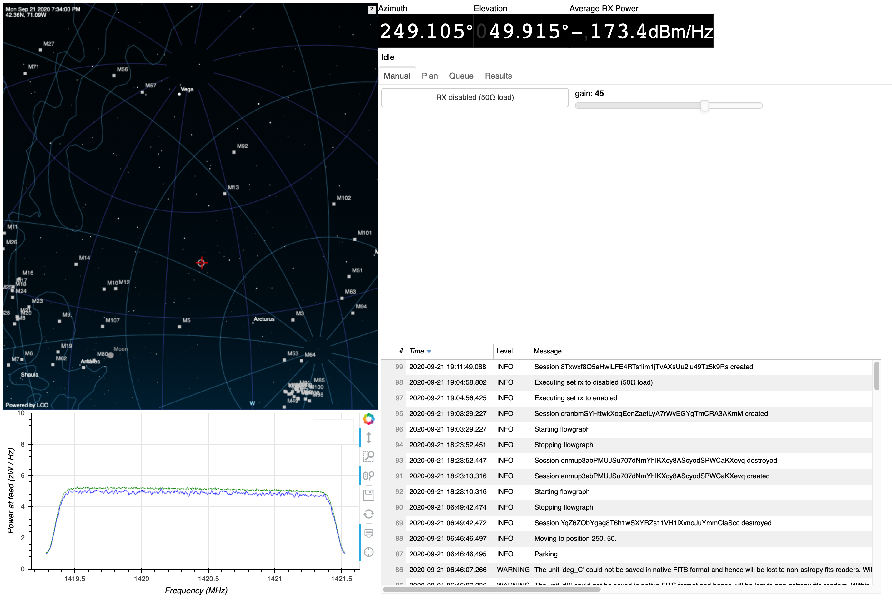

# Galactic Sky Scan

`gal_scan` is a radioastronomy tool that measures the Doppler shift of
the [Hydrogen emissions](https://en.wikipedia.org/wiki/H_I_region)
from our galaxy, producing a plot of the [Galactic Rotation
Curve](https://www.haystack.mit.edu/edu/undergrad/srt/SRT%20Projects/rotation.html). It
can also be used to quantify terrestrial interference and measure
emissions from other galaxies.

## Installation

See INSTALL.md for compilation instructions, if necessary. `gal_scan`
requires GNU Radio, astropy, astroplan, numpy, and matplotlib.

## Running

### Web interface

All functions of `gal_scan` are available in a Bokeh web
interface. Contact your supervisor for access information.



The web UI has four tabs, in order. `Manual` allows manual control of
the telescope. `Plan` shows all of the settings for a survey (each
control matches a command-line parameter described below). `Queue`
shows the surveys currently running and queued, and has a cancel
option to interrupt an in-progress survey. `Results` allows accessing
the data files produced by a previous survey.

### Command-line interface

`gal_scan` can be invoked as a Docker container. At MIT, we launch the
Docker container using a wrapper script that attaches the correct
radio and dish control hardware. A sample invocation of `gal_scan`
looks like:

```
grrun -t w1xm/radioastronomy/gal_scan /flowgraph/run.py --step=2.5 --int-time=60 run_quentin_20200326/
```

### Galactic scan mode

By default, `gal_scan` will trace a line across the sky (galactic
latitude 0) from one horizon to the other. The most important
parameters are `--step`, which specifies the step size in degrees, and
`--int-time`, which specifies the integration time. Decreasing the
step size and increasing the integration time will produce
higher-resolution output at the cost of a longer observing run.

While the scan is running, you can watch the output in your terminal
and follow the antenna status at <http://w1xm-radar-1.mit.edu:8502/>.

### Terrestrial noise scan mode

With `--mode=az`, `gal_scan` will instead trace a line across the
horizon at zero elevation. As with `--mode=gal`, the most important
parameters are `--step` and `--int-time`.

### Grid scan mode

With `--mode=grid`, `gal_scan` will survey a grid around a particular
galactic latitude and longitude. For example, to survey a 10°x10° grid
around Andromeda, `gal_scan` can be invoked as:

```
grrun -t w1xm/radioastronomy/gal_scan /flowgraph/run.py --start=-5 --step=1 --stop=5 --mode=grid --lat=-21.5729360 --lon=121.1744050 --int-time=60 ~/quentin/andromeda_202005021248
```

In this mode, `--start` and `--stop` are interpreted as offsets from
the central (latitude, longitude). Ensure that you carefully choose
the step size and integration time: a 10x10 grid such as the one above
will take 100 observations, which at an integration time of 60 seconds
will take almost two hours.

### Solar grid mode

With `--mode=solar_grid`, `gal_scan` will survey a grid around a solar
system body. `--start`, `--stop`, and `--step` are interpreted as for
`--mode=grid`. The solar system body can be specified with
`--body-name`. For example, to survey a 10°x10° grid
around the moon, `gal_scan` can be invoked as:

```
grrun -t w1xm/radioastronomy/gal_scan /flowgraph/run.py --start=-5 --step=5 --stop=5 --mode=solar_grid --body-name=moon --int-time=10 ~/moon_202005021248
```

## Output

`gal_scan` produces multiple data files and plots in the specified
output directory. For each observing position, there will be two plots
showing average brightness of the Hydrogen line on the Y axis. In the
`freq` plot, the X axis is the frequency at which the emissions were
measured. In the `vel` plot, the frequency is converted to the
equivalent relative velocity.

A 2D plot is also produced showing the brightness and velocity across
the whole galactic disc in `2d_longitude_mesh_normalized.pdf`.

The raw data is saved as a CSV file named `vectors.csv` as well as
multiple Numpy files named `contour_data.npy`, `contour_freqs.npy`,
etc.

### Replotting

All of the plotting code using Numpy and Matplotlib live in
`plot.py`. Plots can easily be regenerated, using any changes you may
have made to `plot.py`, by running `plot.py` in the directory
containing the `*.npy` files:

```
run_20200415$ ../path/to/plot.py
```

Unlike `run.py`, `plot.py` does not require talking to radio and dish
control hardware, so it can be run from a local checkout on your
machine. `plot.py` takes a set of command line arguments for customizing the plots that are generated:

```
run_20200415$ ../path/to/plot.py --help
usage: plot.py [-h] [--xaxes [XAXES [XAXES ...]]] [--yaxis YAXIS]
               [--max-pointing-error DEGREES] [--recalculate-velocities]
               [--skip-1d]

Replot existing data

optional arguments:
  -h, --help            show this help message and exit
  --xaxes [XAXES [XAXES ...]]
                        axes to plot
  --yaxis YAXIS         yaxis to plot
  --max-pointing-error DEGREES
                        reject observations where abs(rci_azimuth-azimuth) >
                        DEGREES
  --recalculate-velocities
                        recalculate velocities
  --skip-1d             skip generating 1D plots
```

In addition, instead of generating PDF files, these plots can be
interactively viewed by running `plot.py` inside
[IPython](https://ipython.org/):

```
run_20200415$ ipython --pylab
In [1]: %run ../plot.py
```

### Manual data analysis and plotting

The data files can also be loaded into a Numpy session and plotted
with varying parameters. The easiest way is to reuse the `plot` module from `gal_scan`:

```Python
# ipython3 --pylab
from plot import *

all_data = load_data('/Users/quentin/Downloads/all_data.fits')
# all_data is an astropy.QTable, which is a collection of Numpy arrays.
# all_data['latitude'] is a 1D array of Galactic latitudes, for instance

averaged_data = average_data(all_data, ['mode'])
plot_velocity(averaged_data[0]['vels'], averaged_data[0]['data'], 'All samples', None)
```

In addition, there are bare Numpy files if you would like to do
analysis completely separate from Astropy. Be aware that Numpy is not
unit-aware so you can more easily make plotting mistakes.

```Python
import matplotlib.pyplot as plt
import matplotlib.colors
import numpy as np

all_data = np.load('all_data.npy')
contour_vels = all_data['vels']
contour_longs = all_data['longitude']
contour_data = all_data['data']

plt.figure()
plt.xlabel('Velocity (km/s)')
plt.ylabel('Galactic Longitude')
plt.ticklabel_format(useOffset=False)
pcm = plt.pcolormesh(contour_longs, contour_vels, contour_data, vmin=0.8e-16, vmax=np.percentile(contour_data, 90), shading='gouraud', norm=matplotlib.colors.LogNorm())
cbar = plt.colorbar(pcm, extend='max')
cbar.ax.set_ylabel('Power at feed (W/Hz)', rotation=-90, va="bottom")
plt.show()
```

It is convenient to run these commands in an interactive Python prompt
so the plotting parameters can be tweaked. Such an environment with
imports already done for you can be obtained with `ipython --pylab`.

## Advanced options

The full parameters that `gal_scan` supports are listed below:

```
usage: run.py [-h] [--sdr-frequency SDR_FREQUENCY] [--bandwidth HZ] [--int-time seconds] [--gain dB] [--repeat REPEAT] [--ref] [--mode {gal,az,grid,solar_grid}]
              [--start START] [--stop STOP] [--step STEP] [--darksky-offset °] [--obj-name OBJ_NAME] [--lat °] [--lon °] [--rotation °]
              [--rotation-frame {icrs,galactic}] [--body-name {earth,sun,moon,mercury,venus,earth-moon-barycenter,mars,jupiter,saturn,uranus,neptune}]
              DIRECTORY

Galactic sky scan

positional arguments:
  DIRECTORY             output directory to write scan results

optional arguments:
  -h, --help            show this help message and exit
  --sdr-frequency SDR_FREQUENCY
                        change SDR frequency
  --bandwidth HZ        change filter bandwidth

General:
  --int-time seconds    integration time
  --gain dB             SDR gain
  --repeat REPEAT       number of times to repeat scan
  --ref                 measure 50Ω reference load

Iterator:
  --mode {gal,az,grid,solar_grid}
  --start START         start
  --stop STOP           end
  --step STEP           step
  --darksky-offset °    darksky offset

mode=grid:
  --obj-name OBJ_NAME   named object
  --lat °               center galactic latitude
  --lon °               center galactic longitude
  --rotation °          grid rotation
  --rotation-frame {icrs,galactic}
                        grid rotation frame

mode=solar_grid:
  --body-name {earth,sun,moon,mercury,venus,earth-moon-barycenter,mars,jupiter,saturn,uranus,neptune}
                        solar body
```

`--start` and `--stop` can be used to limit the scan to a portion of
the sky. `--gain` can be used to increase or decrease the SDR's gain
(sensitivity). `--mode az` can be used to measure terrestrial noise
sources; instead of plotting a line across galactic latitude 0, it
plots a line across elevation 0. `--mode grid` can be used to measure
around a particular coordinate.
